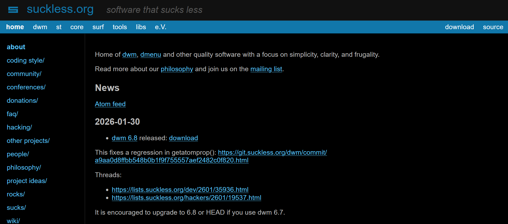

# dotfiles
<p align="center">
  <a href="https://suckless.org">
    
  </a>
</p>

Personal builds of [__suckless__](https://suckless.org/) software used on my **Artix Linux** setup.

## Programs
- **dwm**: dynamic window manager
- **st**: simple terminal
- **dmenu**: dynamic menu
- **slstatus**: status monitor

## Screenshots
<p align="center">
  
</p>

## Installation
Navigate into the desired directory and run:
```bash
sudo make clean install
```

## Dependencies
Ensure you have the base development tools and X11 libraries installed:

- **Artix/Arch:** `sudo pacman -S base-devel libx11 libxft libxinerama`